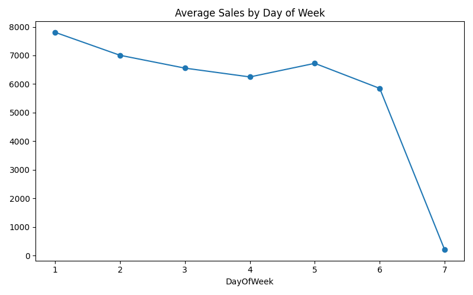
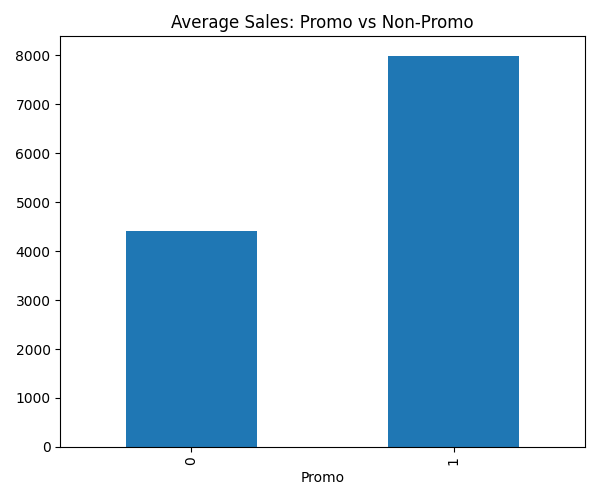
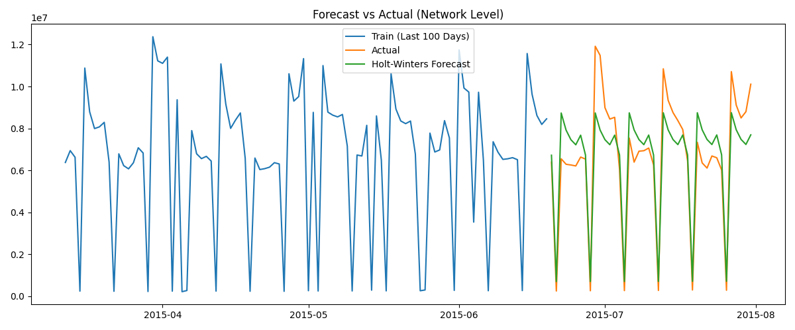

# Demand Forecasting & Inventory Risk Analytics

## Executive Summary
This project analyzes historical retail demand, visualizes seasonal patterns, generates a 6-week daily forecast, and constructs a statistical Demand Risk Proxy to identify store locations requiring priority planning attention. 

## Business Problem
Retail store managers often rely on intuition to estimate daily demand, leading to suboptimal supply chain allocation. A centralized, data-driven forecasting approach is required to establish accurate baselines and identify stores with highly volatile demand patterns.

## Dataset
This project uses the Rossmann Store Sales dataset.
- **train.csv**: 1,017,209 daily observations.
- **store.csv**: 1,115 unique store metadata records.

## Analytical Approach
1. **Investigation & Cleaning**: Preserved valid zero-sales days (closures) while excluding anomalous observations.
2. **SQL Analysis**: Aggregated network and store-level trends utilizing DuckDB.
3. **Exploratory Data Analysis**: Visualized temporal dependencies and promotional effects.
4. **Time-Series Forecasting**: Evaluated baseline and exponential smoothing models on a strict chronological holdout.
5. **Demand Risk Proxy**: Calculated statistical demand volatility to proxy inventory planning risk.

## Data Model
The analytical dataset uses a `Store-Date` grain. Store metadata (e.g., Competition Distance, Store Type) was left-joined to the transaction data using the `Store` ID. Join cardinality was strictly validated, yielding exactly 1,017,155 rows without row multiplication.

## Data Quality & Cleaning
- **Zero-Sales Handling**: Out of 172,871 zero-sales observations, 172,817 were legitimate closed days (e.g., Sundays, holidays) and were intentionally preserved to maintain temporal integrity.
- **Anomaly Exclusion**: Exactly 54 observations featured `Open = 1` but `Sales = 0`. These were treated as anomalous observations and were excluded from the analytical dataset to prevent model distortion.

## SQL Analysis
SQL (DuckDB) was used for robust aggregation:
- Analyzed overall network sales volume (Total Historical Sales: 5,873,180,623).
- Ranked top and bottom performing stores.
- Evaluated promotional versus non-promotional baseline sales averages.

## Exploratory Analysis
Visual investigation revealed massive weekly seasonality and promotional skew:



## Forecasting Methodology
- **Forecast Target**: Daily network sales.
- **Forecast Horizon**: 6 weeks (42 days).
- **Validation**: Strict chronological holdout (the final 42 days of the dataset). No future leakage occurred; no random shuffling was used.

## Forecast Validation
Metrics were calculated on the 42-day chronological holdout using MAE and WAPE (Weighted Absolute Percentage Error, chosen because standard MAPE is mathematically problematic on zero-sales days).
- **Naive Baseline MAE**: 2,507,472
- **7-Day Moving Average MAE**: 2,235,670
- **Holt-Winters MAE**: 1,123,573 (WAPE: 16.79%)

*On the selected 42-day holdout period, the Holt-Winters model achieved the lowest MAE among the evaluated models, effectively capturing the 7-day seasonality.*


## Demand Risk Proxy
Because explicit stock-on-hand, replenishment, and carrying cost data do not exist in this dataset, this project models demand variance, not actual inventory levels. We established a **Demand Risk Proxy** to identify stores where demand is highly erratic and therefore more difficult to plan.

- **Methodology**: Coefficient of Variation (CV), defined as standard deviation divided by mean demand, calculated solely on `Open` days.
- **Project-Defined Threshold**: Stores with `CV > 0.40` are classified as **Severe** risk.
- **Verified Finding**: Exactly **34 stores** are classified as Severe Demand Risk, primarily driven by massive, unpredictable promotional spikes.

## Key Findings
1. **Finding:** Sales were higher on promotional days.
   *Evidence:* Average daily sales significantly increase on promotional days compared to non-promotional days.
   *Business Implication:* Supply chain replenishment must be tightly coupled to the marketing calendar.
2. **Finding:** The Holt-Winters model performed substantially better than the tested Naive and 7-day moving-average baselines on the selected 42-day holdout, indicating that weekly seasonality was important for this dataset.
   *Evidence:* HW reduced forecast WAPE to 16.79%.
   *Business Implication:* Accounting for 7-day cyclicality provides a stronger baseline for network demand planning.
3. **Finding:** Demand volatility is highly localized.
   *Evidence:* Only 34 out of 1115 stores exhibit a Coefficient of Variation above 0.40.
   *Business Implication:* Safety-stock interventions and manual planning review can be strictly focused on these high-risk locations.

## Key Analytical Decisions
1. **Chronological Holdout:** Time-series data has strict temporal dependence; random shuffling would cause future leakage.
2. **42-Day Horizon:** Represents a standard mid-term supply chain planning horizon (6 weeks).
3. **WAPE over MAPE:** MAPE approaches infinity when actual sales drop near zero. WAPE scales absolute error by total volume, providing a robust aggregate metric.
4. **Preservation of Zero-Sales Days:** Closed days are legitimate structural zeros in the time series, necessary for accurate modeling of weekly cycles.
5. **Exclusion of Open=1/Sales=0:** Treated as anomalous observations to prevent distortion of baseline daily sales averages.
6. **CV on Open Days Only:** Including closed days in standard deviation artificially inflates volatility metrics.
7. **Fixed CV Threshold:** A fixed threshold (0.40) identifies absolute volatility, unlike quartiles which force 25% of stores into a 'Severe' bucket regardless of true variance.
8. **No Actual Inventory Claims:** Validated that stock-on-hand is unobserved, meaning true stockouts cannot be confirmed.

## Limitations
- **Demand Proxy vs Inventory:** This analysis measures *demand*, not confirmed stockout events or inventory optimization.
- **Univariate Forecasting:** The Holt-Winters model relies entirely on historical sales. 

## Repository Structure
```text
├── data/
│   ├── raw/                 # Ignored in git, must be downloaded
│   └── cleaned/             
├── notebooks/               # 00 through 05
├── sql/                     # DuckDB analysis scripts
├── reports/                 
│   └── figures/             
├── src/                     # Python execution scripts
├── README.md                
├── requirements.txt         
└── .gitignore
```

## Project Assets
- [Data Investigation Notebook](notebooks/00_data_investigation.ipynb)
- [SQL Analysis](sql/01_sales_and_store_analysis.sql)
- [Forecast vs Actual Chart](reports/figures/04_forecast_vs_actual.png)
- [Project Summary](reports/project_summary.md)
- [Project Audit](reports/project_audit.md)

## Reproducibility
1. Clone this repository.
2. Obtain the Rossmann dataset and place `train.csv` and `store.csv` in `data/raw/`.
3. Install dependencies: `pip install -r requirements.txt`
4. Run the notebooks in sequential order (`00` through `05`).

## Technologies
- **Data Engineering**: DuckDB, Pandas, PyArrow
- **Analytics & Math**: NumPy, Statsmodels
- **Visualization**: Matplotlib
- **Environment**: Python, Jupyter
